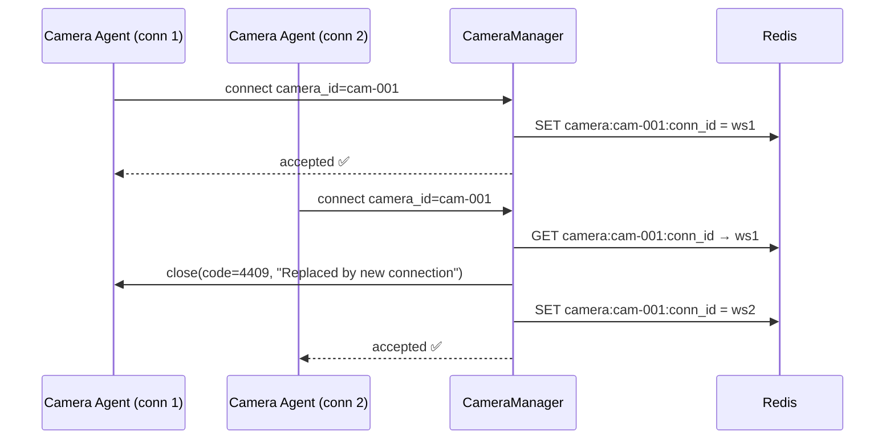
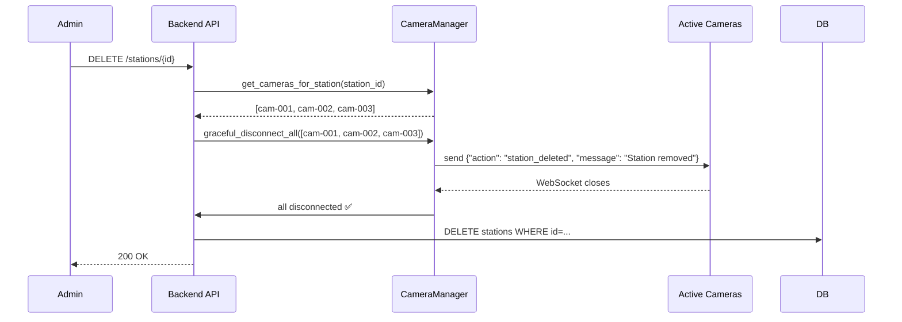

# Chapter 18 — Conflict Management & System Resilience

> **วันที่:** 2026-05-17  
> **บทบาท:** Sr. Software Engineer / System Architect  
> **ระดับ:** World-Class Production Design

---

## 1. ภาพรวม Conflict Landscape

ระบบ Multi-Camera Face Recognition มีจุดที่อาจเกิด conflict หลายระดับ:

```
┌─────────────────────────────────────────────────────────────┐
│                    CONFLICT SOURCES                          │
├──────────────┬──────────────┬──────────────┬────────────────┤
│   Device     │   Network    │   Data       │   Logic        │
│   Level      │   Level      │   Level      │   Level        │
├──────────────┼──────────────┼──────────────┼────────────────┤
│ Duplicate    │ RTSP stream  │ Race cond.   │ Cooldown race  │
│ camera_id    │ multi-open   │ double insert│ bypass         │
│              │              │              │                │
│ Model load   │ WS backpress │ Qdrant dirty │ Clock/timezone │
│ concurrency  │ -ure         │ read         │ mismatch       │
│              │              │              │                │
│ GPU/CPU      │ Reconnect    │ Orphaned     │ Station delete │
│ resource     │ storm        │ vectors      │ while scanning │
└──────────────┴──────────────┴──────────────┴────────────────┘
```

---

## 2. Conflict Matrix — ทุก Scenario

### 2.1 Device Level Conflicts

#### C-001: Duplicate Camera Connection (Same camera_id connects twice)

**เกิดเมื่อ:** Agent reconnect เร็วเกิน, bug ใน agent ส่ง 2 connections, user เปิด 2 tab



**Resolution:** Last-writer-wins — connection ใหม่แทนที่เดิม (graceful takeover)  
**Rationale:** กรณีกล้อง reconnect หลัง network drop เป็นเรื่องปกติ, ควรรับ connection ใหม่ทันที

---

#### C-002: FaceEngine Model Loading Race Condition

**เกิดเมื่อ:** หลาย camera connections ส่ง frame พร้อมกันก่อน model โหลดเสร็จ (cold start)

```python
# WRONG — race condition
class FaceEngine:
    _model = None
    
    def get_detections(self, frame):
        if self._model is None:
            self._model = insightface.app.FaceAnalysis(...)  # 30s ← หลาย thread เรียกพร้อมกัน!
        return self._model.get(frame)
```

```python
# CORRECT — asyncio.Lock prevents concurrent init
import asyncio

class FaceEngine:
    _model = None
    _lock = asyncio.Lock()
    
    async def ensure_loaded(self):
        if self._model is None:
            async with self._lock:          # เฉพาะ 1 coroutine เข้าได้ตอน init
                if self._model is None:     # double-check after lock
                    await asyncio.to_thread(self._load_model)
    
    def _load_model(self):
        self._model = insightface.app.FaceAnalysis(name='buffalo_l', ...)
        self._model.prepare(ctx_id=0, det_size=(640,640))
    
    async def get_detections(self, frame):
        await self.ensure_loaded()
        return await asyncio.to_thread(self._model.get, frame)
```

**Resolution:** asyncio.Lock + double-check pattern  
**Timeout:** ถ้า model ไม่โหลดภายใน 60s → ส่ง 503 พร้อม retry-after header

---

#### C-003: GPU/CPU Resource Contention (Multi-Camera)

**เกิดเมื่อ:** 10+ cameras ส่ง frame พร้อมกัน → ONNX inference queue ล้น

**Solution: Inference Queue with Backpressure**

```python
# services/inference_queue.py

import asyncio
from dataclasses import dataclass

MAX_QUEUE_SIZE = 50          # max frames รอ inference
INFERENCE_WORKERS = 2        # parallel ONNX threads (ปรับตาม CPU cores)

@dataclass
class InferenceTask:
    camera_id: str
    frame: np.ndarray
    result_future: asyncio.Future

class InferenceQueue:
    def __init__(self):
        self._queue = asyncio.Queue(maxsize=MAX_QUEUE_SIZE)
    
    async def submit(self, camera_id: str, frame: np.ndarray):
        """Submit frame for inference. Drops frame if queue full (backpressure)."""
        loop = asyncio.get_event_loop()
        future = loop.create_future()
        task = InferenceTask(camera_id, frame, future)
        
        try:
            self._queue.put_nowait(task)    # non-blocking
            return await future
        except asyncio.QueueFull:
            logger.warning(f"Inference queue full — dropping frame from {camera_id}")
            return []                       # return empty (camera gets empty result)
    
    async def worker(self):
        while True:
            task = await self._queue.get()
            try:
                detections = await asyncio.to_thread(face_engine._model.get, task.frame)
                task.result_future.set_result(detections)
            except Exception as e:
                task.result_future.set_result([])
            finally:
                self._queue.task_done()
```

**Policy:** Drop oldest frame ไม่ใช่ reject connection  
**Monitoring:** log จำนวน dropped frames ต่อ camera ต่อนาที

---

### 2.2 Network Level Conflicts

#### C-004: RTSP Stream Multi-Open (2 Agents เปิด RTSP URL เดียวกัน)

**เกิดเมื่อ:** Admin เพิ่ม camera เดิมซ้ำ, หรือ agent restart ก่อน close เดิม

**Prevention — DB Constraint:**
```sql
-- cameras table: unique rtsp_url per station
ALTER TABLE cameras ADD CONSTRAINT uq_station_rtsp 
    UNIQUE (station_id, rtsp_url);
```

**Prevention — Registry Check:**
```python
async def register_camera(camera_id, rtsp_url, station_id):
    # ตรวจก่อนว่ามี agent เปิด rtsp_url นี้อยู่แล้วหรือยัง
    existing = await redis.get(f"rtsp:active:{hash(rtsp_url)}")
    if existing and existing != camera_id:
        raise ConflictError(f"RTSP URL already in use by camera {existing}")
    
    await redis.setex(f"rtsp:active:{hash(rtsp_url)}", 
                      ttl=30,          # agent ต้อง heartbeat ทุก 15s
                      value=camera_id)
```

---

#### C-005: WebSocket Frame Backpressure

**เกิดเมื่อ:** Camera ส่ง 30 FPS แต่ inference ทำได้แค่ 2 FPS → buffer โต

**Solution: Server-side FPS Throttle + Client Rate Limit**

```python
# websocket.py — per-camera rate limiter

from collections import defaultdict
import time

_last_frame_time: dict[str, float] = defaultdict(float)
MIN_FRAME_INTERVAL = 0.4   # max 2.5 FPS per camera ที่ backend รับ

async def scan_ws(websocket, station_id, camera_id, token):
    while True:
        raw = await websocket.receive_bytes()
        
        # Rate limit — ทิ้ง frame ถ้าส่งเร็วเกิน
        now = time.monotonic()
        if now - _last_frame_time[camera_id] < MIN_FRAME_INTERVAL:
            continue   # drop frame silently
        _last_frame_time[camera_id] = now
        
        # ... process frame ...
```

**Client-side (JS):** ส่งไม่เกิน 2 FPS โดยใช้ `setInterval(500ms)`  
**Mobile (Vue):** `setInterval(1000ms)` เพื่อประหยัด battery

---

#### C-006: Reconnection Storm (Thunder Herd)

**เกิดเมื่อ:** Backend restart → ทุกกล้องพยายาม reconnect พร้อมกัน

**Solution: Exponential Backoff with Jitter (ใน Agent)**

```python
# rtsp_agent.py — reconnection strategy

import random

async def reconnect_with_backoff(connect_fn, max_attempts=10):
    base_delay = 1.0
    for attempt in range(max_attempts):
        try:
            return await connect_fn()
        except Exception as e:
            if attempt == max_attempts - 1:
                raise
            
            # Exponential backoff: 1s, 2s, 4s, 8s... max 60s
            delay = min(base_delay * (2 ** attempt), 60.0)
            # Jitter: ±30% random ป้องกัน thundering herd
            jitter = delay * 0.3 * (random.random() * 2 - 1)
            wait = delay + jitter
            
            logger.info(f"Reconnecting in {wait:.1f}s (attempt {attempt+1})")
            await asyncio.sleep(wait)
```

**Result:** 50 cameras reconnecting → กระจาย 1-60s แทนที่จะ hit พร้อมกัน

---

### 2.3 Data Level Conflicts

#### C-007: Attendance Double-Insert Race Condition

**เกิดเมื่อ:** 2 cameras ที่ Station เดียวกันตรวจเจอคนเดียวกันพร้อมกัน  
→ ทั้งคู่ผ่าน cooldown check → ทั้งคู่ INSERT → duplicate log

```
Camera 1 → check_cooldown(emp1, sta1) → False (key ไม่มี)
Camera 2 → check_cooldown(emp1, sta1) → False (key ยังไม่ set)
Camera 1 → INSERT attendance_log ✅
Camera 2 → INSERT attendance_log ✅  ← DUPLICATE!
Camera 1 → set_cooldown(emp1, sta1)
Camera 2 → set_cooldown(emp1, sta1)
```

**Solution 1 — Redis SETNX (Atomic):**

```python
async def check_and_set_cooldown_atomic(employee_id: str, station_id: str) -> bool:
    """
    Atomic check-and-set. Returns True ถ้า set สำเร็จ (ไม่มี cooldown)
    Returns False ถ้า key มีอยู่แล้ว (cooldown active)
    """
    key = f"cooldown:{employee_id}:{station_id}"
    # SET key value NX EX ttl — atomic: set only if not exists
    result = await redis.set(key, "1", nx=True, ex=COOLDOWN_SECONDS)
    return result is not None   # True = set สำเร็จ = ให้ log ได้

# attendance_service.py
async def log_attendance(db, employee_id, station_id, confidence_score):
    # Atomic check+set — กัน race condition
    acquired = await check_and_set_cooldown_atomic(employee_id, station_id)
    if not acquired:
        return False    # cooldown active หรือ race condition — ไม่ log
    
    # ... INSERT ...
```

**Solution 2 — PostgreSQL Unique Constraint (Fallback):**

```sql
-- ป้องกัน duplicate ระดับ DB (last line of defense)
CREATE UNIQUE INDEX uq_attendance_5min ON attendance_logs (
    employee_id,
    station_id,
    date_trunc('minute', timestamp),  -- truncate ถึงนาที
    floor(extract(minute FROM timestamp) / 5)::int  -- group ทุก 5 นาที
);
```

**Layered Defense:** Redis SETNX → PostgreSQL constraint → application rollback

---

#### C-008: Station Deletion while Camera Active

**เกิดเมื่อ:** Admin ลบ station ขณะที่กล้องกำลัง stream → camera orphaned



**HTTP Response:** ลบ station สำเร็จเมื่อกล้องทุกตัว disconnect แล้วเท่านั้น  
**Timeout:** ถ้า camera ไม่ disconnect ภายใน 5s → force close

---

#### C-009: Clock / Timezone Mismatch

**เกิดเมื่อ:** RTSP Agent รันบน machine ต่าง timezone จาก server  
→ timestamp attendance_log ผิด

**Solution — Always UTC, Convert at Display:**

```python
# Agent side — ไม่ต้องทำอะไร (server ใช้ timestamp ของตัวเอง)
# Backend ใช้ datetime.now(timezone.utc) เสมอ

# Frontend — แสดงตาม user's local timezone
# JavaScript: new Date(utc_string).toLocaleString('th-TH', {timeZone: 'Asia/Bangkok'})
```

**Rule:** 
- Backend เก็บ UTC เสมอ
- Frontend แปลงเป็น local timezone ตาม browser
- API response มี `timezone` field สำหรับ explicit display

---

### 2.4 Logic Level Conflicts

#### C-010: Smartphone Same User Multiple Devices

**เกิดเมื่อ:** ครูล็อกอินพร้อมกันบน 2 มือถือ → camera_id ซ้ำ

**Solution: Device-bound camera_id**

```python
# camera_id = user_id + device fingerprint (ไม่ใช่แค่ user_id)
# Frontend: camera_id = md5(user_id + navigator.userAgent + screen.width)
```

**หรือ: Session-bound (simpler)**
```python
# camera_id = jwt_jti (unique per token issuance)
# ออก token ใหม่ทุกครั้ง → camera_id ใหม่ทุกครั้ง
# Old connection ถูก revoke เมื่อ token หมดอายุ
```

---

#### C-011: Attendance Cooldown Bypass

**เกิดเมื่อ:** Redis ล่ม → `check_attendance_cooldown()` return False เสมอ → log ทุก frame

**Current fallback (ADR):** ถ้า Redis ล่ม ยอมให้ log (better than miss)  
**Improved:** เพิ่ม PostgreSQL cooldown check เป็น fallback

```python
async def check_cooldown_with_fallback(db, employee_id, station_id):
    try:
        return await check_attendance_cooldown(employee_id, station_id)
    except Exception:
        # Redis ล่ม → fallback: ตรวจ DB ว่ามี log ใน 5 นาทีล่าสุดหรือไม่
        cutoff = datetime.now(timezone.utc) - timedelta(seconds=COOLDOWN_SECONDS)
        result = await db.execute(
            select(func.count()).where(
                and_(
                    AttendanceLog.employee_id == employee_id,
                    AttendanceLog.station_id == station_id,
                    AttendanceLog.timestamp >= cutoff
                )
            )
        )
        return result.scalar() > 0   # True = in cooldown
```

---

## 3. Conflict Prevention Summary

```mermaid
graph LR
    subgraph Prevention
        P1[Unique constraints DB]
        P2[Redis NX atomic ops]
        P3[Camera registry]
        P4[FPS rate limit]
        P5[Backoff + jitter]
    end

    subgraph Detection
        D1[Heartbeat timeout]
        D2[Queue depth monitor]
        D3[Dropped frame counter]
        D4[Duplicate log alert]
    end

    subgraph Recovery
        R1[Last-writer-wins WS]
        R2[Graceful disconnect]
        R3[DB fallback cooldown]
        R4[Inference drop policy]
    end

    Prevention --> Detection --> Recovery
```



---

## 4. Conflict Response Policy Table

| Conflict | Detection | Response | Recovery |
|----------|-----------|----------|----------|
| C-001: Duplicate camera_id | CameraManager lookup | Close old, accept new | Event: camera_replaced |
| C-002: Model load race | asyncio.Lock | Queue frames, serve after load | Max 60s timeout |
| C-003: Resource contention | Queue depth > 80% | Drop frames (newest wins) | Alert + auto-scale |
| C-004: RTSP multi-open | DB unique + registry | Reject second agent (409) | Log conflict |
| C-005: Frame backpressure | Buffer > threshold | Drop frame silently | Log drop rate |
| C-006: Reconnect storm | Connection rate spike | Exponential backoff | Jitter spread |
| C-007: Double insert | Redis NX fail | Skip log (idempotent) | DB constraint fallback |
| C-008: Station deleted | Pre-delete check | Graceful disconnect first | Timeout force-close |
| C-009: Timezone mismatch | UTC validation | Server timestamp only | Log warning |
| C-010: Multi-device user | device fingerprint | Session-bound camera_id | Old session expires |
| C-011: Redis down | Exception catch | DB fallback cooldown | Circuit breaker |

---

## 5. Health Check & Monitoring Integration

```python
# GET /health/deep — ตรวจ conflict indicators

{
  "status": "ok",
  "conflicts": {
    "duplicate_cameras": 0,
    "dropped_frames_per_min": 12,        # alert if > 100
    "double_insert_attempts": 0,         # alert if > 0
    "reconnect_storms_today": 1,
    "redis_fallback_events": 0           # alert if > 0 (Redis had issues)
  },
  "cameras": {
    "total_connected": 8,
    "total_paused": 2,
    "total_offline": 1
  },
  "inference_queue": {
    "depth": 3,
    "max": 50,
    "workers": 2
  }
}
```

---

*บันทึกโดย Sr. Software Engineer — OmniSight Project*  
*ดู implementation ใน Sprint 8-9*
