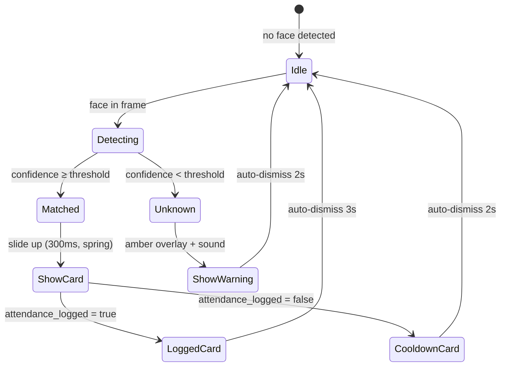

# Chapter 19 — UI/UX Design System (World-Class Grade)

> **วันที่:** 2026-05-17  
> **บทบาท:** Sr. UX Designer / Frontend Architect  
> **Philosophy:** "Right information, right person, right moment — zero cognitive load"

---

## 1. Design Philosophy

### Core Principles

| หลักการ | ความหมาย | ตัวอย่าง |
|---------|---------|---------|
| **Progressive Disclosure** | แสดงข้อมูลตามสิ่งที่ user ต้องการ ณ ตอนนั้น | Scan view: แสดงชื่อ + ✅ ก่อน, รายละเอียดคลิกดูเพิ่ม |
| **Zero Cognitive Load** | User ไม่ต้องคิด — ระบบบอกทุกอย่าง | สี + ไอคอน + เสียง บอกผลทันที |
| **Error Prevention First** | ป้องกันไม่ให้ทำผิดดีกว่าแจ้ง error | Disable ปุ่ม Delete ถ้า station มีกล้องอยู่ |
| **Feedback at Every Step** | ทุก action ต้องได้ feedback ภายใน 100ms | Skeleton loader, optimistic UI, toast |
| **Context-Aware UI** | UI ปรับตาม role, device, state | Mobile ≠ Desktop, ADMIN ≠ OPERATOR |

---

## 2. User Personas & Journey Maps

### Persona 1 — ADMIN (IT Manager / Head of Security)

```
Profile: สุริยา, 38, IT Manager
Device:  Desktop (27") + Tablet
Context: Control room, dim lighting
Goal:    เห็น "ทุกอย่าง" และ "ควบคุมได้ทุกอย่าง"
Pain:    ต้องสลับหน้าจอบ่อยเพื่อดูสถานะกล้อง
```

**Journey:**
```
Login → Pilot Console →
  ├─ เห็น camera grid ทั้งหมดทันที (< 3s load)
  ├─ เห็น alert ถ้ากล้อง offline (real-time)
  ├─ คลิก camera tile → zoom + ควบคุม (Pause/Resume/Config)
  ├─ เห็น live attendance events ทางขวา
  └─ Export report ได้จาก 1 คลิก
```

---

### Persona 2 — HR Manager

```
Profile: นภา, 35, HR Manager  
Device:  Desktop (24") + Laptop
Context: Office, normal lighting
Goal:    ดูรายงาน, จัดการพนักงาน, export ข้อมูล
Pain:    ต้องรอ IT ออก report, ข้อมูลไม่ทันปัจจุบัน
```

**Journey:**
```
Login → Dashboard (KPI cards) →
  ├─ Attendance Report → filter วันที่/แผนก → ดูตาราง
  ├─ Export CSV/Excel 1 คลิก
  ├─ คลิกชื่อพนักงาน → profile + attendance history
  └─ จัดการ Employee enrollment ถ้าจำเป็น
```

---

### Persona 3 — OPERATOR (Security Guard / Receptionist)

```
Profile: วิทย์, 28, Security Guard
Device:  Tablet 10" / Desktop monitor ขนาดใหญ่
Context: ทางเข้าอาคาร, แสงสว่างต่างกัน, busy environment
Goal:    รู้ทันทีว่า "คนนี้คือใคร อนุญาตเข้าได้ไหม"
Pain:    ไม่มีเวลาอ่านรายละเอียด ต้องตัดสินใจเร็ว
```

**Journey:**
```
Login → Scan View (auto-start) →
  ├─ กล้องเปิดอัตโนมัติ
  ├─ ตรวจเจอหน้า → แสดงชื่อ + แผนก + สีใหญ่ ๆ (< 500ms)
  ├─ เสียง "ติ๊ง" เมื่อ match ✅ / "ตุ้ง" เมื่อ unknown ⚠
  └─ ไม่ต้อง click อะไรเลย — passive display
```

---

### Persona 4 — TEACHER / AUTHORIZED OPERATOR (Mobile)

```
Profile: ครูสมหญิง, 42, ครูประจำชั้น
Device:  Smartphone (Android/iOS)
Context: สนามโรงเรียน, แสงแดด, เดินแสกน
Goal:    เช็คชื่อนักเรียน 30 คนให้เสร็จใน 5 นาที
Pain:    มือถือร้อน, battery หมด, กดยาก, แสงสะท้อน
```

**Journey:**
```
Login (remember me) → Mobile Scan →
  ├─ กล้องหน้าเปิดอัตโนมัติ portrait mode
  ├─ เดินเข้าหานักเรียน → แสกนทีละคน
  ├─ ชื่อโผล่ใหญ่ + Haptic feedback (vibrate)
  ├─ Counter: "เช็คแล้ว 18/30" แสดงตลอด
  └─ Pause ได้จากปุ่ม 1 ปุ่ม
```

---

## 3. Design System — Tokens & Components

### 3.1 Color Palette

```css
/* Status Colors — Universal Meaning */
--color-match:    #22C55E;   /* green-500  — ✅ recognized */
--color-unknown:  #F59E0B;   /* amber-500  — ⚠ unknown face */
--color-error:    #EF4444;   /* red-500    — ❌ error / offline */
--color-paused:   #6B7280;   /* gray-500   — ⏸ paused */
--color-pending:  #3B82F6;   /* blue-500   — 🔄 processing */

/* Brand */
--color-primary:  #6366F1;   /* indigo-500 */
--color-surface:  #0F172A;   /* slate-900  — dark mode base */
--color-panel:    #1E293B;   /* slate-800  — card background */
--color-border:   #334155;   /* slate-700  — dividers */

/* Text */
--color-text-primary:   #F8FAFC;   /* slate-50  */
--color-text-secondary: #94A3B8;   /* slate-400 */
--color-text-muted:     #475569;   /* slate-600 */
```

### 3.2 Typography Scale

```css
/* Sizes — ใหญ่พอสำหรับ control room / outdoor */
--text-display:  clamp(2rem, 4vw, 3rem);      /* ชื่อบน Scan View */
--text-title:    clamp(1.25rem, 2vw, 1.5rem);
--text-body:     1rem;    /* 16px minimum */
--text-caption:  0.875rem;

/* Weight */
--font-bold:     700;
--font-medium:   500;
--font-normal:   400;
```

### 3.3 Motion & Feedback

```css
/* Transitions — fast enough to feel instant, slow enough to feel smooth */
--duration-instant:  100ms;   /* hover states */
--duration-fast:     200ms;   /* button clicks, toggles */
--duration-normal:   300ms;   /* panel open/close */
--duration-slow:     500ms;   /* page transitions */

/* Easing */
--ease-out:    cubic-bezier(0.16, 1, 0.3, 1);   /* snappy */
--ease-spring: cubic-bezier(0.34, 1.56, 0.64, 1); /* bouncy for match */
```

---

## 4. Pilot Console — Detailed UX Design

### 4.1 Layout Architecture

```
┌─────────────────────────────────────────────────────────────────────┐
│ TOPBAR (56px)                                                        │
│ [🎯 OmniSight]  [● LIVE: 12 cameras]  [⚡ System OK]  [🔔 2] [Admin▾]│
├──────────┬──────────────────────────────────────┬───────────────────┤
│ SIDEBAR  │  MAIN CONTENT                        │  ACTIVITY PANEL   │
│ (220px)  │  (fluid)                             │  (320px)          │
│          │                                      │                   │
│ Stations │  Camera Grid / Station Detail        │  Live Events      │
│ Tree     │                                      │  ──────────────   │
│          │                                      │  Attendance Stats │
│ ──────── │                                      │  ──────────────   │
│ Quick    │                                      │  Alerts           │
│ Actions  │                                      │                   │
│          │                                      │                   │
└──────────┴──────────────────────────────────────┴───────────────────┘
│ STATUSBAR (32px): CPU 23% | RAM 4.2/16GB | DB ✅ | Qdrant ✅ | Redis ✅│
└─────────────────────────────────────────────────────────────────────┘
```

### 4.2 Camera Grid — States & Micro-interactions

```
┌─────────────────────────────────┐   ┌─────────────────────────────────┐
│ [LIVE FRAME - darkened overlay] │   │ [LIVE FRAME]                    │
│                    ●LIVE 2.1fps │   │                   ●LIVE 1.8fps  │
│                                 │   │  ┌──────────────────────┐       │
│   ● สมชาย มีใจดี ✅              │   │  │ 👤 มานี สุขดี        │       │
│   Engineering | 10:32:15        │   │  │ HR Dept | 99.1%      │ ← fade│
│─────────────────────────────────│   │  └──────────────────────┘  in 3s│
│ 📷 Entrance Cam   [IP_CAMERA]   │   │─────────────────────────────────│
│ 📍 Floor 1 — Main Gate          │   │ 📱 Teacher Phone    [SMARTPHONE] │
│─────────────────────────────────│   │ 📍 Classroom 3A — Morning       │
│ [⏸] [⚙] [✖]    FPS: ●●●○○ 2   │   │─────────────────────────────────│
└─────────────────────────────────┘   │ [⏸] [⚙] [✖]    FPS: ●●●●○ 3  │
                                      └─────────────────────────────────┘

┌─────────────────────────────────┐   ┌─────────────────────────────────┐
│ ░░░░░░░░░░░░░░░░░░░░░░░░░░░░░ │   │ [GRAYSCALE LAST FRAME]          │
│ ░░░░  ⏸  PAUSED  ░░░░░░░░░░░ │   │           ⚠ OFFLINE             │
│ ░░░░░░░░░░░░░░░░░░░░░░░░░░░░░ │   │      Last seen: 5m ago          │
│─────────────────────────────────│   │─────────────────────────────────│
│ 📷 Parking Cam    [IP_CAMERA]   │   │ 📷 Server Room    [CCTV]        │
│─────────────────────────────────│   │─────────────────────────────────│
│ [▶] [⚙] [✖]    FPS: ─────      │   │ [🔄 Reconnect] [⚙]             │
└─────────────────────────────────┘   └─────────────────────────────────┘
```

**Color States:**
- `LIVE` badge: `--color-match` (green) pulse animation
- `PAUSED` overlay: `rgba(0,0,0,0.7)` + gray icon
- `OFFLINE` overlay: `rgba(0,0,0,0.8)` + red warning + last seen time
- Match overlay: green border flash (200ms) + face box

### 4.3 Camera Tile — Hover & Click Behavior

```
ON HOVER:
  - Control buttons fade in (opacity 0 → 1, 200ms)
  - Thumbnail scales to 1.02
  - Border color shifts to primary

ON CLICK (tile body):
  - Open Camera Detail Panel (slide in from right, 300ms)
  - Show: full-size feed, today's attendance count, recent events

ON CLICK (⏸ Pause):
  - Immediate optimistic UI: tile goes to PAUSED state
  - Send WS command: {"action": "pause_camera", "camera_id": "..."}
  - On success: confirm state
  - On fail: revert + toast error

ON CLICK (⚙ Config):
  - Open slide-over panel: camera settings
  - Can change: name, location, FPS limit, quality

ON CLICK (✖ Stop):
  - Confirm dialog: "Disconnect camera? Agent will need to reconnect manually."
  - Two-step: confirm → execute
```

---

## 5. Scan View — OPERATOR UX

### 5.1 Information Hierarchy

```
┌──────────────────────────────────────────────────────┐
│  SCAN VIEW — Floor 1 Gate                [⚙] [Exit] │
├──────────────────────────────────────────────────────┤
│                                                      │
│         [LIVE CAMERA FEED — full width]              │
│                                                      │
│  ┌──────────────────────────────────────────────┐   │
│  │  [face bbox overlay with name label]          │   │
│  └──────────────────────────────────────────────┘   │
│                                                      │
├──────────────────────────────────────────────────────┤
│  MATCH CARD (slides up when detected, auto-dismiss)  │
│  ┌────────────────────────────────────────────────┐  │
│  │  ✅  สมชาย มีใจดี                              │  │
│  │      วิศวกรรม  |  E-0042  |  99.1%            │  │
│  │      บันทึกเวลา 10:32:15 ✅                    │  │
│  └────────────────────────────────────────────────┘  │
│                                                      │
│  [Today: 87 IN]  [5 Late]  [13 Absent]              │
└──────────────────────────────────────────────────────┘
```

### 5.2 State Machine — Match Card



### 5.3 Feedback Design

| Event | Visual | Sound | Haptic (Mobile) |
|-------|--------|-------|-----------------|
| Match + Logged | Green card slides up, border flash | "ติ๊ง" (pleasant bell) | 1 short pulse |
| Match + Cooldown | Blue card (dimmed), "Already logged" | Soft "ป๊อบ" | None |
| Unknown | Amber overlay, question mark | "ตุ้ง" (neutral) | 2 short pulses |
| Camera error | Red top banner | Alert tone | 3 pulses |

**Sound Design:**
- เสียงเบาพอสำหรับ office แต่ชัดเจนในสภาพแวดล้อมที่มีเสียง
- มี volume control + mute option
- เสียง distinct ชัดเจน ไม่สับสน

---

## 6. Mobile Scan View — Teacher/Field Operator

### 6.1 Portrait Mode Layout

```
┌─────────────────────────┐  ← 390px wide (iPhone 14)
│ ≡  Morning Roll Call    │  ← topbar 56px
│    Class 3A  |  07:45   │
├─────────────────────────┤
│                         │
│   [CAMERA VIEWFINDER]   │  ← 390×480px
│                         │
│  ┌───────────────────┐  │
│  │ สมศักดิ์ แก้วใส   │  │  ← face box label
│  └───────────────────┘  │
│                         │
├─────────────────────────┤
│  18 / 30 เช็คแล้ว      │  ← progress bar + counter
│  ████████████░░░░░░░░░  │
├─────────────────────────┤
│ ┌───────────────────┐   │
│ │ ✅ สมศักดิ์ แก้วใส │   │  ← match card (auto-dismiss 2s)
│ │    ม.3/1  เลขที่ 5 │   │
│ └───────────────────┘   │
├─────────────────────────┤
│  [⏸ PAUSE]  [📋 List]  │  ← bottom actions (thumb-zone)
└─────────────────────────┘
```

### 6.2 Mobile-Specific UX Rules

```
✅ Thumb-zone design: ปุ่มสำคัญอยู่ครึ่งล่าง
✅ Min touch target: 48×48dp (Material Design standard)
✅ Auto-pause เมื่อ app background (ประหยัด battery)
✅ Resume เมื่อ app foreground
✅ Low-power mode: ลด FPS เหลือ 1fps เมื่อ battery < 20%
✅ Offline indicator: ถ้าขาด network > 3s แสดง banner
✅ Screen brightness: แนะนำ max brightness (outdoor mode)
✅ Landscape lock: ล็อกไว้ Portrait เพื่อ stability
✅ Keep-awake: ป้องกัน screen lock ตลอด session
```

### 6.3 Quick Actions (Swipe Gestures)

| Gesture | Action |
|---------|--------|
| Swipe up | เปิด attendance list |
| Swipe down | Minimize camera (ดูรายชื่อ full screen) |
| Double tap | Zoom in camera |
| Long press on name | Mark manual (ถ้า face ไม่ detect) |

---

## 7. Enrollment View — HR / Admin

### 7.1 6-Slot Enrollment UX

```
┌──────────────────────────────────────────────────────────────┐
│  Enrollment — สมชาย มีใจดี (E-0042)              [← Back]   │
├──────────────────────────────────────────────────────────────┤
│                                                              │
│  [CAMERA PREVIEW — Live]              SLOTS                  │
│  ┌─────────────────────────┐    ┌──┐ ┌──┐ ┌──┐             │
│  │                         │    │✅│ │✅│ │✅│  ← done     │
│  │   [face bbox overlay]   │    └──┘ └──┘ └──┘             │
│  │                         │    ┌──┐ ┌──┐ ┌──┐             │
│  │   Quality: ████████░░   │    │🔄│ │○ │ │○ │  ← pending  │
│  │           0.82 (GOOD)   │    └──┘ └──┘ └──┘             │
│  └─────────────────────────┘                                 │
│                                                              │
│  Guidance (auto-change):                                     │
│  ┌────────────────────────────────────────────────────────┐  │
│  │  📸 Slot 4: Please turn slightly to the LEFT           │  │
│  │     ← Hold still for 2 seconds                        │  │
│  └────────────────────────────────────────────────────────┘  │
│                                                              │
│  [📸 Capture Slot 4]              [🔄 Retake Last]           │
│                                                              │
│  ──────────────────────────────────────────────────────────  │
│  ✅ Slots 1-3 complete  |  🔄 Slots 4-6 remaining           │
└──────────────────────────────────────────────────────────────┘
```

**Guidance System (Auto-prompt per slot):**

| Slot | คำแนะนำ | เหตุผล |
|------|---------|--------|
| 0 | หน้าตรง ดูกล้องตรง ๆ | baseline embedding |
| 1 | หันซ้ายเล็กน้อย 15° | มุมซ้าย |
| 2 | หันขวาเล็กน้อย 15° | มุมขวา |
| 3 | เงยหน้าขึ้นเล็กน้อย | มุมบน (กล้อง CCTV สูง) |
| 4 | ก้มหน้าลงเล็กน้อย | มุมล่าง |
| 5 | หน้าตรง + แสงต่างกัน (ขยับไปข้างหน้าต่าง) | lighting variation |

**Quality Gate:**
- Quality < 0.6: ❌ "ภาพไม่ชัด กรุณาถ่ายใหม่" (ไม่บันทึก)
- Quality 0.6–0.75: ⚠️ "คุณภาพต่ำ ถ่ายใหม่หรือยืนยัน"
- Quality ≥ 0.75: ✅ บันทึกอัตโนมัติ

---

## 8. HR Dashboard — Data Visualization

### 8.1 KPI Cards (Above the fold)

```
┌──────────────┐  ┌──────────────┐  ┌──────────────┐  ┌──────────────┐
│  Present     │  │  Late        │  │  Absent      │  │  On Leave    │
│     87       │  │      5       │  │     13       │  │      3       │
│  ────────    │  │  ────────    │  │  ────────    │  │  ────────    │
│  82.1% ↑2%  │  │  4.7% ↓1%   │  │  12.3% ↑1%  │  │  2.8%        │
│  vs yesterday│  │              │  │              │  │  Approved    │
└──────────────┘  └──────────────┘  └──────────────┘  └──────────────┘
```

### 8.2 Attendance Timeline Chart

```
Arrivals per hour today (bar chart)
08:00 ████████████████████████  52
09:00 ████████████░░░░░░░░░░░░  28  ← late threshold
10:00 ██░░░░░░░░░░░░░░░░░░░░░░   5  ← very late
11:00 ░░░░░░░░░░░░░░░░░░░░░░░░   2  ← suspicious
     ↑ Shift starts 08:00    ↑ Grace period ends 08:30
```

### 8.3 Department Breakdown (Heatmap)

```
                Mon  Tue  Wed  Thu  Fri
Engineering     ███  ███  ██░  ███  ██░   95% / 94% / 88% / 96% / 89%
HR              ███  ██░  ███  ███  ██░
Finance         ██░  ███  ██░  ██░  ███
Operations      ██░  ██░  ██░  ██░  ██░   ← consistently low → alert

Color: green=100% | yellow=80-99% | orange=60-79% | red=<60%
```

---

## 9. Accessibility & Inclusive Design

### Requirements

| ข้อกำหนด | Implementation |
|---------|---------------|
| Color blindness | ไม่ใช้ color เป็นข้อมูลเดียว — เสมอมี icon + text |
| Low vision | Min font 16px, contrast ratio ≥ 4.5:1 (WCAG AA) |
| Motor impairment | Keyboard navigable, min click target 48px |
| Screen reader | ARIA labels บน dynamic elements |
| Outdoor use (bright) | High contrast mode, max brightness API |
| Slow network | Skeleton loaders, offline mode, cached last state |

### Color Contrast Check

```
Background (#0F172A) + Primary text (#F8FAFC) = 17.2:1  ✅ AAA
Background (#0F172A) + Secondary text (#94A3B8) = 5.8:1  ✅ AA
Panel (#1E293B) + Match color (#22C55E) = 4.7:1          ✅ AA
```

---

## 10. Responsive Breakpoints

```
Mobile Portrait:  < 640px   → Mobile Scan, Login only
Mobile Landscape: 640-768px → Compact scan view
Tablet:           768-1024px → HR Dashboard, simplified console
Desktop HD:       1024-1440px → Full Pilot Console
Desktop 4K:       > 1440px  → Pilot Console + extended grid
```

### Pilot Console Grid — Responsive

| Breakpoint | Camera Grid | Sidebar | Activity |
|------------|-------------|---------|----------|
| Mobile | Hidden (link to Mobile Scan) | — | — |
| Tablet | 2×2 grid | Hidden (hamburger) | Bottom drawer |
| Desktop HD | 3×2 grid | 220px fixed | 320px fixed |
| Desktop 4K | 4×3 grid | 220px fixed | 400px fixed |

---

## 11. Interaction Design — Pilot Console

### 11.1 Keyboard Shortcuts (Power Users)

| Key | Action |
|-----|--------|
| `G` | Toggle camera grid layout (2×2 / 3×2 / 4×3) |
| `F` | Focus search (find camera/station) |
| `P` | Pause selected camera |
| `R` | Resume selected camera |
| `E` | Export today's attendance |
| `1–9` | Select camera tile by number |
| `Esc` | Close modal / deselect |
| `?` | Show keyboard shortcut guide |

### 11.2 Notification System

**Notification Hierarchy (by severity):**

```
CRITICAL  → Full-screen overlay + alarm sound
           "Camera offline: Main Gate [5m ago]"
           [Investigate] [Dismiss]

HIGH      → Top banner (persistent until dismissed)
           "Unknown face detected repeatedly: Parking Cam (8 times in 5min)"
           [View] [×]

MEDIUM    → Toast (bottom-right, 8s)
           "Low attendance today: Operations Dept 61%"
           [View Report] [×]

LOW       → Activity feed only (no popup)
           "Camera reconnected: Hall B"
```

### 11.3 Optimistic UI Pattern

```
User clicks [Pause Camera]
  → Immediately: tile shows PAUSED state (no wait)
  → Background: send WS command
  → Success: confirm (no visual change, already correct)
  → Failure: revert to LIVE state + toast "Failed to pause: Network error"
             retry option available
```

---

## 12. Design Tokens (สำหรับ Implementation)

```javascript
// tailwind.config.js extensions
theme: {
  extend: {
    colors: {
      'status-match':   '#22C55E',
      'status-unknown': '#F59E0B',
      'status-error':   '#EF4444',
      'status-paused':  '#6B7280',
      'console-bg':     '#0F172A',
      'console-panel':  '#1E293B',
      'console-border': '#334155',
    },
    animation: {
      'match-flash': 'matchFlash 0.5s ease-out',
      'live-pulse':  'pulse 2s cubic-bezier(0.4, 0, 0.6, 1) infinite',
      'card-up':     'slideUp 0.3s cubic-bezier(0.34, 1.56, 0.64, 1)',
    },
    keyframes: {
      matchFlash: {
        '0%':   { boxShadow: '0 0 0 0 rgba(34, 197, 94, 0.8)' },
        '100%': { boxShadow: '0 0 0 20px rgba(34, 197, 94, 0)' },
      },
      slideUp: {
        from: { transform: 'translateY(100%)', opacity: '0' },
        to:   { transform: 'translateY(0)',    opacity: '1' },
      }
    }
  }
}
```

---

## 13. UX Acceptance Criteria (Per Screen)

### Pilot Console
- [ ] Camera grid loads in < 3s (skeleton shown immediately)
- [ ] Live event appears within 500ms of attendance log
- [ ] Camera state change (pause/resume) reflected < 200ms
- [ ] Offline camera detected and shown within 10s
- [ ] Keyboard shortcut `G` cycles grid layouts

### Scan View (Operator)
- [ ] Match card appears within 500ms of face detection
- [ ] Auto-dismiss after 3s (no interaction required)
- [ ] Unknown face shows amber warning within 500ms
- [ ] Sound plays on every match (with mute option)
- [ ] Screen never goes to sleep during active scan

### Mobile Scan (Teacher/Authorized)
- [ ] App loads and camera opens in < 3s
- [ ] Match name visible outdoors (contrast ≥ 7:1 in bright mode)
- [ ] Haptic feedback on every match
- [ ] Counter updates immediately after each match
- [ ] Pause/Resume accessible with thumb (bottom of screen)
- [ ] App pauses when backgrounded, resumes when foregrounded

### Enrollment
- [ ] Quality score updates live (every frame)
- [ ] Guidance text updates per slot
- [ ] Quality gate blocks low-quality captures
- [ ] Slot completion shows immediate visual feedback
- [ ] Retake last slot available without losing others

---

*บันทึกโดย Sr. UX Designer / Frontend Architect — OmniSight Project*  
*ดู implementation plan ใน Sprint 9-10 (chapter_17)*
