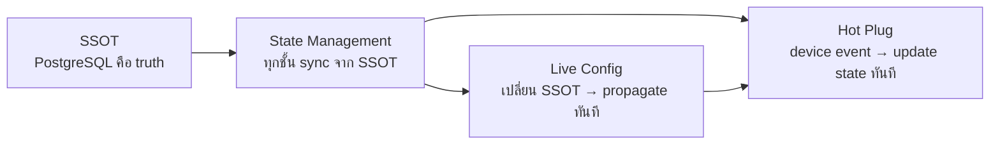
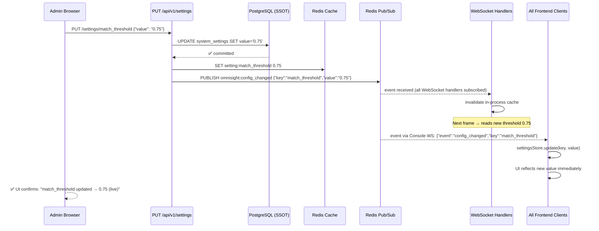
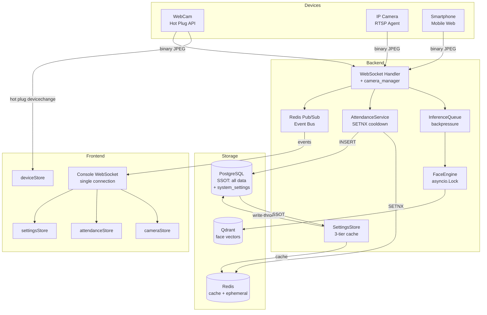

# Chapter 20 — SSOT, State Management, Live Config & Hot Plug

> **วันที่:** 2026-05-17  
> **บทบาท:** Sr. Software Architect  
> **ระดับ:** World-Class Production Architecture

---

## 1. ทำไม 4 เรื่องนี้ถึงเชื่อมกัน

```
┌─────────────────────────────────────────────────────────────────┐
│                     CORE PROBLEM                                │
│                                                                 │
│  ระบบมีหลาย "ชั้น" ที่เก็บ state:                             │
│  .env / code → PostgreSQL → Redis → Backend memory → Frontend  │
│                                                                 │
│  ถ้าไม่มี SSOT   → ข้อมูลขัดแย้งกัน                           │
│  ถ้าไม่ sync state → UI ไม่ตรงกับ reality                      │
│  ถ้า config ไม่ live → restart บ่อย, downtime                  │
│  ถ้า hot plug ไม่ทำงาน → user ต้อง restart เอง               │
└─────────────────────────────────────────────────────────────────┘
```

**ความสัมพันธ์:**



---

## 2. SSOT — Single Source of Truth

### 2.1 ปัญหาเดิม (Before)

```
ตอนนี้ข้อมูลอยู่กระจัดกระจาย:
├── .env / code          → MATCH_THRESHOLD=0.72, COOLDOWN=300
│                           ← เปลี่ยนต้อง restart ❌
├── PostgreSQL           → employees, stations, attendance, cameras
├── Redis                → station:filter, cooldown keys
│                           ← อาจ diverge จาก PostgreSQL ❌
└── Backend memory       → camera connections dict
                            ← หาย เมื่อ restart ❌
```

### 2.2 SSOT Architecture (After)

```
┌─────────────────────────────────────────────────────────────────┐
│                    SINGLE SOURCE OF TRUTH                        │
│                                                                 │
│  PostgreSQL                                                     │
│  ├── employees, departments, shifts, stations, cameras          │
│  ├── face_templates, attendance_logs                            │
│  └── system_settings  ← NEW (เก็บ config ที่ปรับได้)           │
│                                                                 │
│  RULE: PostgreSQL คือ truth เสมอ                               │
│        Redis เป็นแค่ cache (derived, expendable)               │
│        .env เก็บแค่ secrets + infrastructure (DB URL, etc.)    │
└─────────────────────────────────────────────────────────────────┘
                              │
                    write-through / invalidate
                              │
                              ▼
┌─────────────────────────────────────────────────────────────────┐
│                         REDIS (Cache Layer)                     │
│  ├── station:{id}:filter     → derived from stations.dept_ids  │
│  ├── setting:{key}           → derived from system_settings    │
│  ├── camera:{id}:status      → ephemeral (connection state)    │
│  └── cooldown:{emp}:{sta}    → ephemeral (business rule)       │
│                                                                 │
│  RULE: ถ้า Redis miss → fallback ไป PostgreSQL                  │
│        ถ้า Redis ล่ม → ระบบยังทำงานได้ (slower)               │
└─────────────────────────────────────────────────────────────────┘
                              │
                         pub/sub events
                              │
                              ▼
┌─────────────────────────────────────────────────────────────────┐
│                    APPLICATION LAYER                            │
│  Backend: reads from Redis (fast path) or PostgreSQL (slow)    │
│  Frontend: Pinia stores — synced via WebSocket events          │
└─────────────────────────────────────────────────────────────────┘
```

### 2.3 system_settings Table (New)

```sql
CREATE TABLE system_settings (
    key         VARCHAR(100) PRIMARY KEY,
    value       TEXT NOT NULL,
    value_type  VARCHAR(20) NOT NULL,   -- float | int | bool | string | json
    description TEXT,
    updated_by  UUID REFERENCES users(id),
    updated_at  TIMESTAMPTZ DEFAULT now()
);

-- Seed default values
INSERT INTO system_settings VALUES
  ('match_threshold',      '0.72',  'float',  'Minimum cosine similarity for face match', NULL, now()),
  ('cooldown_seconds',     '300',   'int',    'Attendance cooldown period in seconds', NULL, now()),
  ('max_fps_per_camera',   '2',     'int',    'Max frames per second the backend accepts', NULL, now()),
  ('inference_workers',    '2',     'int',    'ONNX inference parallel workers', NULL, now()),
  ('min_face_quality',     '0.6',   'float',  'Minimum enrollment quality score', NULL, now()),
  ('unknown_face_alert',   '5',     'int',    'Alert threshold: unknown faces per 5min', NULL, now()),
  ('face_detect_size',     '640',   'int',    'Detection input size (640 or 320)', NULL, now());
```

### 2.4 Settings Access Pattern

```python
# core/settings_store.py — Central settings accessor

import asyncio
from app.db.redis import redis
from app.db.postgres import async_session_factory
from sqlalchemy import select
from app.models.orm import SystemSetting

_cache: dict[str, str] = {}   # in-process cache (fastest)
_cache_lock = asyncio.Lock()

async def get_setting(key: str, default=None):
    """
    3-tier lookup: in-process cache → Redis → PostgreSQL
    """
    # Tier 1: in-process cache (nanoseconds)
    if key in _cache:
        return _cast(_cache[key])

    # Tier 2: Redis (< 1ms)
    try:
        val = await redis.get(f"setting:{key}")
        if val:
            _cache[key] = val
            return _cast(val)
    except Exception:
        pass

    # Tier 3: PostgreSQL (fallback)
    async with async_session_factory() as db:
        row = await db.get(SystemSetting, key)
        if row:
            val = row.value
            _cache[key] = val
            try:
                await redis.set(f"setting:{key}", val)
            except Exception:
                pass
            return _cast(val)

    return default

async def set_setting(key: str, value, updated_by: str = None):
    """
    Write-through: PostgreSQL first → Redis → invalidate in-process cache
    """
    val_str = str(value)
    
    # 1. Write to PostgreSQL (SSOT)
    async with async_session_factory() as db:
        row = await db.get(SystemSetting, key)
        if row:
            row.value = val_str
            row.updated_by = updated_by
            row.updated_at = datetime.now(timezone.utc)
        else:
            db.add(SystemSetting(key=key, value=val_str, updated_by=updated_by))
        await db.commit()

    # 2. Update Redis cache
    try:
        await redis.set(f"setting:{key}", val_str)
    except Exception:
        pass

    # 3. Invalidate in-process cache (all instances via pub/sub)
    _cache.pop(key, None)
    await redis.publish("omnisight:config_changed", json.dumps({"key": key, "value": val_str}))
```

---

## 3. Live Config — Settings Take Effect Immediately

### 3.1 Config Change Flow



### 3.2 Settings API

```
GET  /api/v1/settings           → list all settings
GET  /api/v1/settings/{key}     → get one setting + history
PUT  /api/v1/settings/{key}     → update (ADMIN only) → live effect
POST /api/v1/settings/reset/{key} → reset to default
```

### 3.3 Hotness Classification

| Setting | Live? | Method | หมายเหตุ |
|---------|-------|--------|---------|
| `match_threshold` | ✅ ทันที | Redis pub/sub invalidate | ใช้ใน next frame |
| `cooldown_seconds` | ✅ ทันที | Redis pub/sub invalidate | ใช้กับ new cooldown requests |
| `max_fps_per_camera` | ✅ ทันที | WS command → all cameras | ส่ง `set_fps` ไปทุก camera |
| `min_face_quality` | ✅ ทันที | Cache invalidate | ใช้ใน next enrollment |
| `unknown_face_alert` | ✅ ทันที | Cache invalidate | ใช้ใน next alert eval |
| `inference_workers` | ⚠️ Graceful | Drain queue → restart workers | รอ queue ว่างก่อน |
| `face_detect_size` | ⚠️ Graceful | Reload FaceEngine | ต้อง reload model (30s) |
| `onnx_provider` (CPU/GPU) | 🔄 Restart | บันทึกไว้ใช้ next startup | ต้อง reload ทั้งหมด |

### 3.4 Settings UI (Admin Only)

```
┌────────────────────────────────────────────────────────────────┐
│  ⚙ System Settings                              [Admin only]  │
├────────────────────────────────────────────────────────────────┤
│  AI Recognition                                                │
│  ┌──────────────────────────────────────────────────────────┐  │
│  │ Match Threshold    [────●──────────] 0.72               │  │
│  │                    range: 0.50 – 0.95                    │  │
│  │                    ⚡ Live — takes effect immediately    │  │
│  ├──────────────────────────────────────────────────────────┤  │
│  │ Face Detect Size   ○ 320px  ● 640px  ○ 1280px           │  │
│  │                    ⚠ Graceful — reloads model (~30s)     │  │
│  └──────────────────────────────────────────────────────────┘  │
│                                                                │
│  Attendance                                                    │
│  ┌──────────────────────────────────────────────────────────┐  │
│  │ Cooldown Period    [5] minutes   ⚡ Live                 │  │
│  │ Quality Threshold  [0.60]        ⚡ Live                 │  │
│  └──────────────────────────────────────────────────────────┘  │
│                                                                │
│  Camera                                                        │
│  ┌──────────────────────────────────────────────────────────┐  │
│  │ Max FPS per Camera [2] fps       ⚡ Live (sends to all)  │  │
│  │ Inference Workers  [2]           ⚠ Graceful restart      │  │
│  └──────────────────────────────────────────────────────────┘  │
│                                                                │
│  [Save Changes]  [Reset to Defaults]                           │
│  Last updated: 10:32:15 by admin                               │
└────────────────────────────────────────────────────────────────┘

Legend: ⚡ Live = immediate effect | ⚠ Graceful = < 60s | 🔄 Restart = required
```

---

## 4. Hot Plug — Device Detection

### 4.1 Browser WebCam Hot Plug

**Problem:** User เสียบ/ถอด webcam ขณะใช้งาน → กล้องดับ หรือกล้องใหม่ไม่ขึ้น

```javascript
// stores/cameraDeviceStore.js (Pinia)

import { defineStore } from 'pinia'

export const useCameraDeviceStore = defineStore('cameraDevice', {
  state: () => ({
    availableDevices: [],       // MediaDeviceInfo[]
    selectedDeviceId: null,
    activeStream: null,
    isHotPlugging: false,       // true ระหว่าง device change
  }),

  actions: {
    async init() {
      // Initial enumerate
      await this.refreshDevices()

      // Hot plug listener
      navigator.mediaDevices.addEventListener('devicechange', async () => {
        this.isHotPlugging = true
        const before = this.selectedDeviceId

        await this.refreshDevices()

        // Device was unplugged — auto-switch to first available
        if (before && !this.availableDevices.find(d => d.deviceId === before)) {
          console.warn(`Camera ${before} unplugged — auto-switching`)
          await this.switchToDevice(this.availableDevices[0]?.deviceId)
          this.notify('warn', 'กล้องหลุด — สลับไปกล้องสำรองแล้ว')
        }

        // New device plugged in — notify user
        const after = this.availableDevices.map(d => d.deviceId)
        const newDevices = after.filter(id => 
          !this._prevDevices?.includes(id)
        )
        if (newDevices.length > 0) {
          this.notify('info', `ตรวจพบกล้องใหม่ ${newDevices.length} ตัว`)
        }

        this._prevDevices = after
        this.isHotPlugging = false
      })
    },

    async refreshDevices() {
      const devices = await navigator.mediaDevices.enumerateDevices()
      this.availableDevices = devices.filter(d => d.kind === 'videoinput')
    },

    async switchToDevice(deviceId) {
      if (this.activeStream) {
        this.activeStream.getTracks().forEach(t => t.stop())
      }
      const stream = await navigator.mediaDevices.getUserMedia({
        video: { deviceId: { exact: deviceId }, width: 1280, height: 720 }
      })
      this.activeStream = stream
      this.selectedDeviceId = deviceId
      return stream
    },
  }
})
```

### 4.2 Hot Plug UI (Device Selector)

```
┌──────────────────────────────────────────────────────────────┐
│ 📷 Camera Source                              [⟳ Refresh]   │
│                                                              │
│ ● Logitech C920 (USB)           ← selected                  │
│ ○ Integrated Webcam (built-in)                              │
│ ○ OBS Virtual Camera                                        │
│                           [New device detected! ▲]          │
│ → USB 3.0 Camera (new)    [Use this camera]                 │
└──────────────────────────────────────────────────────────────┘
```

**Auto-behaviors:**
- เสียบกล้องใหม่ → toast "New camera detected" + option to switch
- ถอดกล้องที่ใช้อยู่ → auto-switch ไปกล้องที่เหลือ + toast warning
- ถอดกล้องทุกตัว → แสดง "No camera found" screen + retry button
- Reconnect: `devicechange` เกิดอีกครั้ง → ไปเช็ค availability อีกรอบ

### 4.3 Backend Camera Hot Register/Deregister

**เมื่อ Camera Agent เชื่อมต่อ (Hot Register):**

```python
# websocket.py — on connect

async def scan_ws(websocket, station_id, camera_id, token):
    await websocket.accept()
    
    # Hot Register: update Redis immediately
    await camera_manager.register(
        camera_id=camera_id,
        station_id=station_id,
        camera_type=detect_camera_type(token),
        ws=websocket,
    )
    # Publish to Pilot Console instantly
    await publish_event({
        "event": "camera_connected",
        "camera_id": camera_id,
        "station_id": station_id,
        "timestamp": utcnow(),
    })
    
    try:
        while True:
            # ... process frames ...
    
    except WebSocketDisconnect:
        # Hot Deregister
        await camera_manager.deregister(camera_id)
        await publish_event({
            "event": "camera_disconnected",
            "camera_id": camera_id,
            "last_seen": utcnow(),
        })
```

**Pilot Console รับรู้ทันที** — ผ่าน Redis Pub/Sub → WS → Pinia store

### 4.4 Offline Camera Detection (Heartbeat)

```python
# camera_manager.py

HEARTBEAT_INTERVAL = 15    # agent ต้อง ping ทุก 15s
OFFLINE_THRESHOLD  = 30    # ถ้าไม่มี activity 30s → offline

async def heartbeat_monitor():
    """Background task: ตรวจกล้องที่ไม่ส่ง frame นานเกินไป"""
    while True:
        await asyncio.sleep(10)
        now = time.time()
        
        all_cameras = await redis.smembers("cameras:active")
        for cam_id in all_cameras:
            last_seen = await redis.get(f"camera:{cam_id}:last_seen")
            if last_seen and (now - float(last_seen)) > OFFLINE_THRESHOLD:
                current = await redis.get(f"camera:{cam_id}:status")
                if current != "offline":
                    await redis.set(f"camera:{cam_id}:status", "offline")
                    await publish_event({
                        "event": "camera_offline",
                        "camera_id": cam_id,
                        "last_seen": last_seen,
                    })
```

---

## 5. State & Store Management

### 5.1 State Architecture Overview

```
┌──────────────────────────────────────────────────────────────────┐
│                    STATE HIERARCHY                               │
│                                                                 │
│  PostgreSQL (SSOT) ─────────────────────────────────────────── │
│       │ write-through / event-driven invalidation              │
│       ▼                                                         │
│  Redis (Distributed Cache)                                      │
│  ├── Ephemeral state:  camera connections, cooldowns           │
│  └── Cached state:     settings, station filters               │
│       │ pub/sub events                                          │
│       ▼                                                         │
│  Backend Process Memory (per instance)                          │
│  ├── in-process settings cache (fastest)                       │
│  ├── camera_manager: active WebSocket connections              │
│  └── inference_queue: pending frames                           │
│       │ WebSocket push                                          │
│       ▼                                                         │
│  Frontend Pinia Stores (browser)                               │
│  ├── authStore, settingsStore, cameraStore                     │
│  ├── attendanceStore, notificationStore                        │
│  └── deviceStore (webcam devices)                              │
└──────────────────────────────────────────────────────────────────┘
```

### 5.2 Backend State — CameraManager

```python
# services/camera_manager.py

from dataclasses import dataclass, field
from typing import Dict, Optional
import asyncio

@dataclass
class CameraConnection:
    camera_id:    str
    station_id:   str
    camera_type:  str
    websocket:    object      # WebSocket instance
    connected_at: float = field(default_factory=time.time)
    last_frame:   float = field(default_factory=time.time)
    frame_count:  int = 0
    fps:          float = 0.0
    status:       str = "active"  # active | paused | offline

class CameraManager:
    """
    Single source of truth for camera connection state (in this process).
    Persists to Redis for cross-process / Pilot Console visibility.
    """
    
    _connections: Dict[str, CameraConnection] = {}
    _lock = asyncio.Lock()

    async def register(self, camera_id: str, station_id: str, 
                       camera_type: str, ws) -> CameraConnection:
        async with self._lock:
            # Kick old connection if exists (C-001: duplicate camera_id)
            if camera_id in self._connections:
                old = self._connections[camera_id]
                await old.websocket.close(code=4409, reason="Replaced by new connection")

            conn = CameraConnection(camera_id, station_id, camera_type, ws)
            self._connections[camera_id] = conn

            # Persist to Redis
            await self._sync_to_redis(conn)
            await redis.sadd("cameras:active", camera_id)

            return conn

    async def deregister(self, camera_id: str):
        async with self._lock:
            self._connections.pop(camera_id, None)
            await redis.srem("cameras:active", camera_id)
            await redis.set(f"camera:{camera_id}:status", "offline")

    async def send_command(self, camera_id: str, command: dict) -> bool:
        conn = self._connections.get(camera_id)
        if conn and conn.status != "offline":
            await conn.websocket.send_text(json.dumps(command))
            return True
        return False

    async def pause(self, camera_id: str):
        if await self.send_command(camera_id, {"action": "pause"}):
            self._connections[camera_id].status = "paused"
            await redis.set(f"camera:{camera_id}:status", "paused")

    async def resume(self, camera_id: str):
        if await self.send_command(camera_id, {"action": "resume"}):
            self._connections[camera_id].status = "active"
            await redis.set(f"camera:{camera_id}:status", "active")

    def record_frame(self, camera_id: str):
        """Call on every received frame — updates FPS, last_seen."""
        conn = self._connections.get(camera_id)
        if conn:
            now = time.time()
            elapsed = now - conn.last_frame
            conn.fps = 0.8 * conn.fps + 0.2 * (1 / elapsed if elapsed > 0 else 0)
            conn.last_frame = now
            conn.frame_count += 1
            # Non-blocking Redis update (fire-and-forget)
            asyncio.ensure_future(
                redis.setex(f"camera:{camera_id}:last_seen", 60, str(now))
            )

# Singleton
camera_manager = CameraManager()
```

### 5.3 Frontend State — Pinia Stores Architecture

```javascript
// stores/index.js — Store Map

// authStore       → JWT, user, role, permissions
// settingsStore   → system settings (synced from backend via WS)
// cameraStore     → all cameras state (synced via Console WS)
// deviceStore     → LOCAL webcam devices (from browser API)
// attendanceStore → today's events + stats
// notificationStore → alerts, toasts queue
// uiStore         → layout preferences, dark mode, grid size
```

```javascript
// stores/cameraStore.js
import { defineStore } from 'pinia'
import { useConsoleWebSocket } from '@/composables/useConsoleWebSocket'

export const useCameraStore = defineStore('camera', {
  state: () => ({
    cameras: {},           // { [camera_id]: CameraState }
    stations: {},          // { [station_id]: { cameras: [] } }
    selectedCameraId: null,
  }),

  getters: {
    activeCameras:      s => Object.values(s.cameras).filter(c => c.status === 'active'),
    offlineCameras:     s => Object.values(s.cameras).filter(c => c.status === 'offline'),
    camerasByStation:   s => stationId => Object.values(s.cameras)
                               .filter(c => c.station_id === stationId),
  },

  actions: {
    // Called by Console WebSocket event handler
    handleEvent(event) {
      switch (event.event) {
        case 'camera_connected':
          this.cameras[event.camera_id] = {
            ...event,
            status: 'active',
            fps: 0,
            frame_count: 0,
            last_frame_url: null,
          }
          break

        case 'camera_disconnected':
        case 'camera_offline':
          if (this.cameras[event.camera_id]) {
            this.cameras[event.camera_id].status = 'offline'
            this.cameras[event.camera_id].last_seen = event.last_seen
          }
          break

        case 'camera_paused':
          if (this.cameras[event.camera_id])
            this.cameras[event.camera_id].status = 'paused'
          break

        case 'camera_stats':
          if (this.cameras[event.camera_id]) {
            this.cameras[event.camera_id].fps = event.fps
            this.cameras[event.camera_id].frame_count = event.frame_count
          }
          break

        case 'face_detected':
        case 'attendance_logged':
          if (this.cameras[event.camera_id]) {
            this.cameras[event.camera_id].last_event = event
          }
          break

        case 'config_changed':
          useSettingsStore().handleConfigChanged(event)
          break
      }
    },

    // Commands → send to backend via Console WS
    async pauseCamera(cameraId) {
      this.cameras[cameraId].status = 'paused'    // optimistic UI
      await consoleWs.send({ action: 'pause_camera', camera_id: cameraId })
    },

    async resumeCamera(cameraId) {
      this.cameras[cameraId].status = 'active'    // optimistic UI
      await consoleWs.send({ action: 'resume_camera', camera_id: cameraId })
    },
  }
})
```

```javascript
// stores/settingsStore.js
export const useSettingsStore = defineStore('settings', {
  state: () => ({
    settings: {},        // { key: { value, type, description, liveness } }
    pendingKeys: new Set(), // keys being saved
  }),

  actions: {
    async loadAll() {
      const res = await api.get('/settings')
      this.settings = Object.fromEntries(res.data.map(s => [s.key, s]))
    },

    async update(key, value) {
      this.pendingKeys.add(key)
      const prev = this.settings[key]?.value
      this.settings[key].value = value    // optimistic
      try {
        await api.put(`/settings/${key}`, { value })
      } catch (e) {
        this.settings[key].value = prev   // revert on error
        throw e
      } finally {
        this.pendingKeys.delete(key)
      }
    },

    // Called by cameraStore.handleEvent when config_changed received
    handleConfigChanged({ key, value }) {
      if (this.settings[key]) {
        this.settings[key].value = value
        this.settings[key].last_synced = new Date().toISOString()
      }
    },
  }
})
```

### 5.4 Console WebSocket — Single Connection, All Events

```javascript
// composables/useConsoleWebSocket.js
// หนึ่ง WebSocket connection สำหรับ Pilot Console
// ส่ง events ไปยัง stores ที่เกี่ยวข้อง

import { ref, onMounted, onUnmounted } from 'vue'
import { useCameraStore } from '@/stores/cameraStore'
import { useAttendanceStore } from '@/stores/attendanceStore'
import { useNotificationStore } from '@/stores/notificationStore'

export function useConsoleWebSocket() {
  const ws = ref(null)
  const connected = ref(false)

  const EVENT_HANDLERS = {
    // Route events to the right store
    camera_connected:    e => useCameraStore().handleEvent(e),
    camera_disconnected: e => useCameraStore().handleEvent(e),
    camera_offline:      e => useCameraStore().handleEvent(e),
    camera_paused:       e => useCameraStore().handleEvent(e),
    camera_stats:        e => useCameraStore().handleEvent(e),
    face_detected:       e => useCameraStore().handleEvent(e),
    attendance_logged:   e => {
      useCameraStore().handleEvent(e)
      useAttendanceStore().addEvent(e)
    },
    unknown_face:        e => useNotificationStore().addAlert(e),
    config_changed:      e => useCameraStore().handleEvent(e),
  }

  function connect(token) {
    ws.value = new WebSocket(`${WS_BASE}/api/v1/ws/console?token=${token}`)
    
    ws.value.onmessage = ({ data }) => {
      const event = JSON.parse(data)
      const handler = EVENT_HANDLERS[event.event]
      if (handler) handler(event)
    }

    ws.value.onopen  = () => { connected.value = true }
    ws.value.onclose = () => {
      connected.value = false
      // Auto-reconnect with backoff
      setTimeout(() => connect(token), 3000)
    }
  }

  async function send(command) {
    if (ws.value?.readyState === WebSocket.OPEN) {
      ws.value.send(JSON.stringify(command))
    }
  }

  return { connected, send, connect }
}
```

---

## 6. Data Flow Summary (Complete Picture)



---

## 7. Implementation Checklist

### SSOT
- [ ] สร้าง `system_settings` table + seed defaults
- [ ] `SettingsStore` class (3-tier: memory → Redis → PostgreSQL)
- [ ] ลบ hardcoded constants จาก config.py → ย้ายไป system_settings
- [ ] `GET/PUT /api/v1/settings` endpoints (ADMIN only)

### Live Config
- [ ] Redis pub/sub subscription ใน backend startup
- [ ] Config change handler invalidates in-process cache
- [ ] `config_changed` event ส่งไป Pilot Console clients
- [ ] ⚡/⚠/🔄 liveness indicator ใน Settings UI

### Hot Plug
- [ ] `navigator.mediaDevices.addEventListener('devicechange', ...)` ใน deviceStore
- [ ] Auto-switch on unplug
- [ ] Toast notification on new device
- [ ] Keep-awake API (`navigator.wakeLock`) ใน Scan + Mobile view
- [ ] Backend heartbeat monitor (30s timeout → offline event)

### State Management
- [ ] `CameraManager` singleton ใน backend
- [ ] Per-camera FPS tracking + Redis last_seen TTL
- [ ] `useConsoleWebSocket` composable (single WS, event router)
- [ ] All Pinia stores handle events from Console WS
- [ ] Optimistic UI pattern ใน pause/resume/settings

---

## 8. Anti-Patterns (สิ่งที่ห้ามทำ)

| Anti-Pattern | ปัญหา | ทางเลือกที่ถูก |
|-------------|-------|---------------|
| Frontend polls `/cameras` ทุก 1s | N×requests/s, delayed, wasteful | Console WS push |
| Config อยู่ใน `.env` เท่านั้น | ต้อง restart เพื่อเปลี่ยน | `system_settings` table |
| Redis เป็น SSOT | ข้อมูลหายเมื่อ Redis restart | PostgreSQL = SSOT |
| Global mutable state ใน backend | Race condition ใน async | CameraManager + asyncio.Lock |
| Frontend แต่ละ page เปิด WS แยก | หลาย connections, state inconsistent | 1 Console WS ต่อ session |
| Camera disconnect ไม่แจ้ง UI | UI แสดงสถานะเก่า | Pub/sub → immediate event |
| `navigator.mediaDevices` ไม่ listen event | Hot plug ไม่ work | `addEventListener('devicechange')` |

---

*บันทึกโดย Sr. Software Architect — OmniSight Project*  
*ทั้ง 4 pillars ต้อง implement พร้อมกันใน Sprint 8-10*
