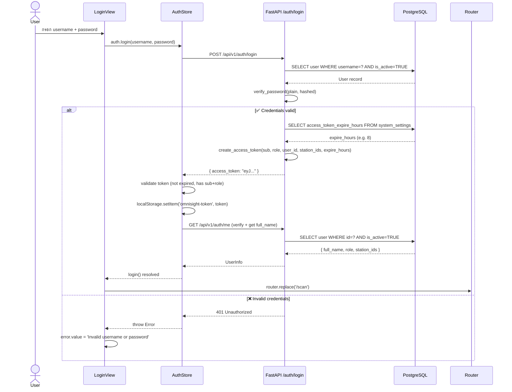
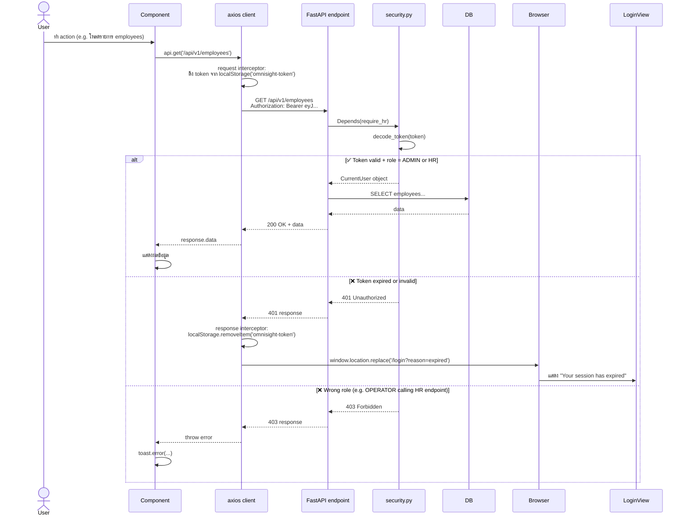
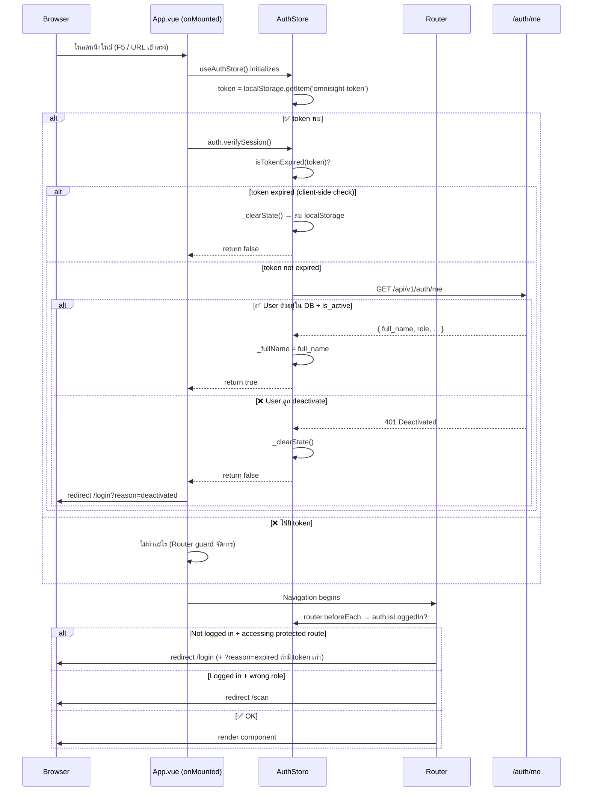
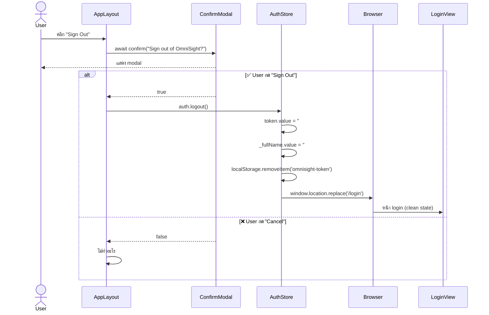

# Chapter 22 — Authentication & Authorization

> เขียน: 2026-05-17 | Sprint 8

---

## ภาพรวม

OmniSight ใช้ **JWT Bearer Token** สำหรับ Authentication และ **Role-Based Access Control (RBAC)** สำหรับ Authorization โดยมีหลักการ:

- **SSOT (Single Source of Truth)**: `auth.js` store เป็นศูนย์กลาง — ทุก component อ่าน auth state จากที่เดียว
- **Double-check**: Frontend guard + Backend dependency ทั้งคู่ต้องผ่าน
- **Defense-in-depth**: Token expiry เช็คทั้งฝั่ง client (computed) และ server (JWT decode)

---

## Roles

| Role | ย่อว่า | สิทธิ์ |
|------|--------|--------|
| `ADMIN` | ผู้ดูแลระบบ | ทุกอย่าง |
| `HR` | HR Manager | อ่าน/แก้ข้อมูล HR, ดู Attendance |
| `OPERATOR` | เจ้าหน้าที่สแกน | Scan เฉพาะ station ที่ได้รับมอบหมาย |

---

## Sequence Diagrams

### 1. Login Flow



---

### 2. Protected API Call Flow



---

### 3. App Load / Session Restore Flow



---

### 4. Logout Flow



---

## API Authorization Matrix

### ✅ = Protected | 🔴 = Unprotected (ก่อนแก้)

| Module | Endpoint | Method | Required Role | After Fix |
|--------|----------|--------|---------------|-----------|
| **auth** | /auth/login | POST | none (public) | ✅ by design |
| **auth** | /auth/me | GET | any auth user | ✅ |
| **users** | /users | GET | ADMIN | ✅ |
| **users** | /users | POST | ADMIN | ✅ |
| **users** | /users/{id} | GET/PUT/DELETE | ADMIN | ✅ |
| **users** | /users/{id}/stations | PUT | ADMIN | ✅ |
| **departments** | /departments | GET | HR + ADMIN | ✅ fixed |
| **departments** | /departments | POST | ADMIN | ✅ fixed |
| **departments** | /departments/{id} | PUT/DELETE | ADMIN | ✅ fixed |
| **employees** | /employees | GET | HR + ADMIN | ✅ fixed |
| **employees** | /employees | POST | HR + ADMIN | ✅ fixed |
| **employees** | /employees/{id} | GET/PATCH | HR + ADMIN | ✅ fixed |
| **enrollment** | /employees/{id}/enrollment | GET | HR + ADMIN | ✅ fixed |
| **enrollment** | /employees/{id}/enroll | POST | HR + ADMIN | ✅ fixed |
| **enrollment** | /employees/{id}/enroll/{idx} | DELETE | HR + ADMIN | ✅ fixed |
| **stations** | /stations | GET | any auth user | ✅ fixed |
| **stations** | /stations | POST | ADMIN | ✅ fixed |
| **stations** | /stations/{id} | GET | any auth user | ✅ fixed |
| **stations** | /stations/{id}/departments | PUT | ADMIN | ✅ fixed |
| **attendance** | /attendance | GET | HR + ADMIN | ✅ fixed |
| **cameras** | /cameras | GET | HR + ADMIN | ✅ |
| **cameras** | /cameras | POST | ADMIN | ✅ |
| **cameras** | /cameras/{id} | GET | HR + ADMIN | ✅ |
| **cameras** | /cameras/{id} | PUT/DELETE | ADMIN | ✅ |
| **cameras** | /cameras/{id}/pause,resume | POST | ADMIN | ✅ |
| **shifts** | /shifts | GET | HR + ADMIN | ✅ fixed |
| **shifts** | /shifts | POST | ADMIN | ✅ fixed |
| **shifts** | /shifts/{id} | DELETE | ADMIN | ✅ fixed |
| **settings** | /settings | GET/PUT | ADMIN | ✅ |
| **websocket** | /ws/scan/{station_id} | WS | any auth + station check | ✅ |

---

## Frontend Route Guard Matrix

| Route | Allowed Roles | Guard |
|-------|---------------|-------|
| /scan | All (ADMIN, HR, OPERATOR) | auth only |
| /attendance | ADMIN, HR | `roles: ['ADMIN','HR']` |
| /employees | ADMIN, HR | `roles: ['ADMIN','HR']` |
| /employees/:id/enroll | ADMIN, HR | `roles: ['ADMIN','HR']` |
| /departments | ADMIN, HR | `roles: ['ADMIN','HR']` |
| /stations | ADMIN | `roles: ['ADMIN']` |
| /cameras | ADMIN | `roles: ['ADMIN']` |
| /users | ADMIN | `roles: ['ADMIN']` |
| /settings | ADMIN | `roles: ['ADMIN']` |
| /login | public | redirect to /scan if logged in |

---

## Auth Store SSOT Design

```
┌─────────────────────────────────────────────────────────┐
│                    auth.js (Pinia Store)                 │
│                                                         │
│  token (ref)  ──────────────────────────────────────┐  │
│     │                                               │  │
│     ▼                                               ▼  │
│  user (computed)                          localStorage  │
│     ├── checks isTokenExpired()          'omnisight-    │
│     ├── checks p.sub && p.role           token'         │
│     └── returns null if any fail                        │
│                                                         │
│  isLoggedIn = !!user (covers expiry)                    │
│  isAdmin    = role === 'ADMIN'                          │
│  isHR       = role in ['ADMIN','HR']                    │
│  expiresIn  = p.exp - now (seconds)                     │
│                                                         │
│  login()         → stores token + calls verifySession() │
│  logout()        → clears all + redirect /login         │
│  forceLogout()   → called by 401 interceptor            │
│  verifySession() → calls /me on app load                │
└─────────────────────────────────────────────────────────┘
```

---

## Security Dependencies (backend)

```python
# security.py — ใช้เป็น Depends() ใน endpoint

get_current_user    # ✅ any valid JWT → decode only
require_hr          # ✅ role must be ADMIN or HR
require_admin       # ✅ role must be ADMIN
get_current_user_ws # ✅ WebSocket version (token via query param)
```

---

## Known Limitations (ยังไม่ได้แก้)

| Issue | Severity | หมายเหตุ |
|-------|----------|---------|
| Token stored in localStorage (XSS risk) | 🟡 MEDIUM | httpOnly cookie จะปลอดภัยกว่า แต่ต้องเปลี่ยน architecture มาก |
| No token revocation (blacklist) | 🟡 MEDIUM | logout ลบแค่ client-side, token ยังใช้ได้บน server จนหมดอายุ |
| No CSRF protection | 🟡 MEDIUM | ป้องกันด้วย CORS policy (allow_origins ระบุชัด) |
| WebSocket token ไม่ revoke เมื่อ logout | 🟡 LOW | Long-lived WS ยังทำงานได้หลัง logout |

---

## Files ที่เกี่ยวข้อง

| ไฟล์ | บทบาท |
|------|-------|
| `frontend/src/stores/auth.js` | SSOT — token + user state ทั้งหมด |
| `frontend/src/api/client.js` | Axios — attach token + 401 handler |
| `frontend/src/router/index.js` | Route guards + roles array |
| `frontend/src/views/LoginView.vue` | Login form + session expired banner |
| `frontend/src/layouts/AppLayout.vue` | Sign out confirm |
| `backend/app/core/security.py` | JWT decode + FastAPI dependencies |
| `backend/app/api/auth.py` | /login + /me endpoints |

---

*อัพเดทล่าสุด: 2026-05-17 (Sprint 8)*
